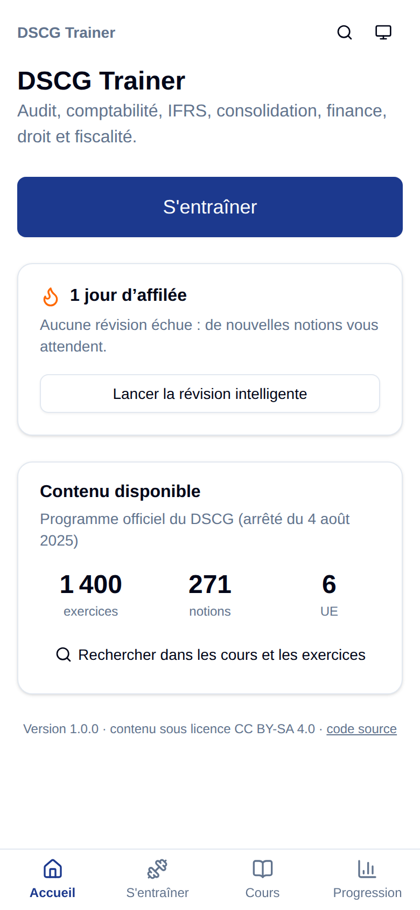
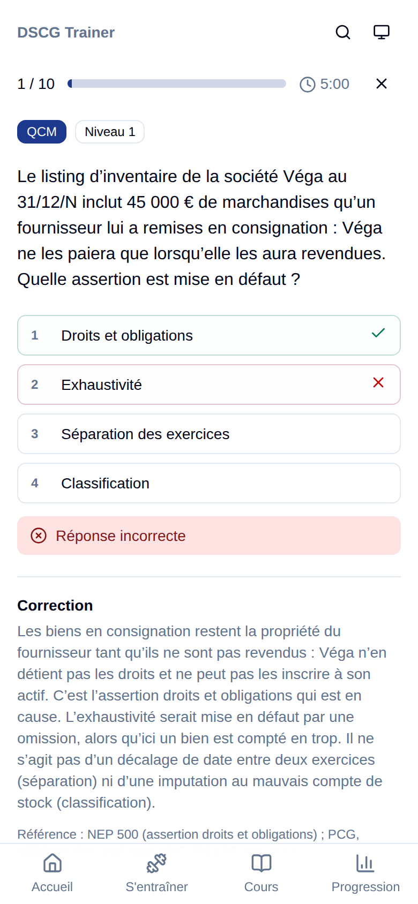
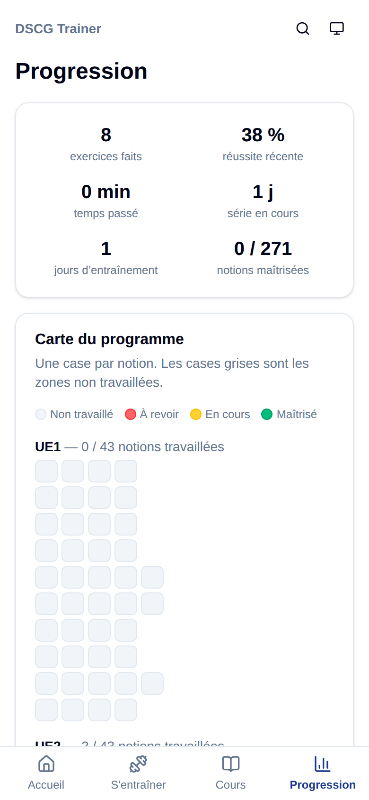
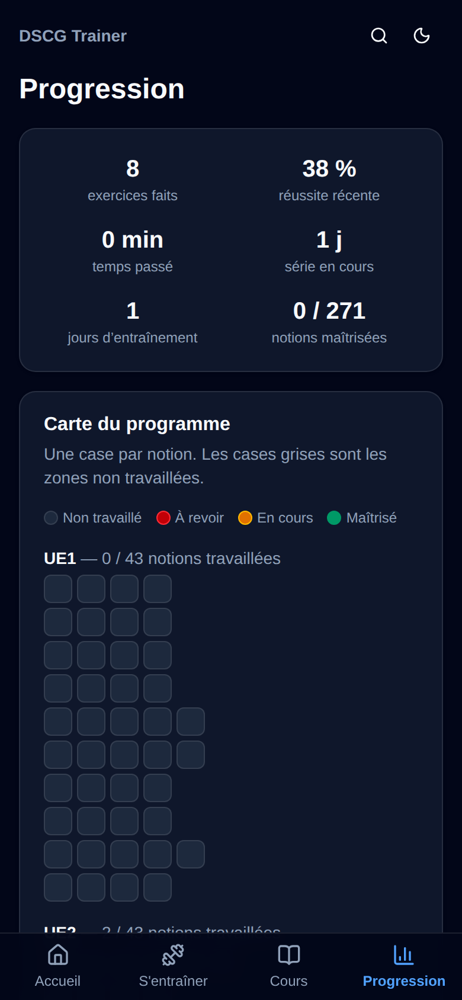
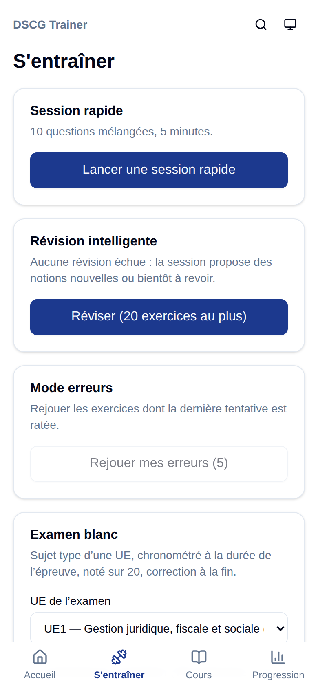
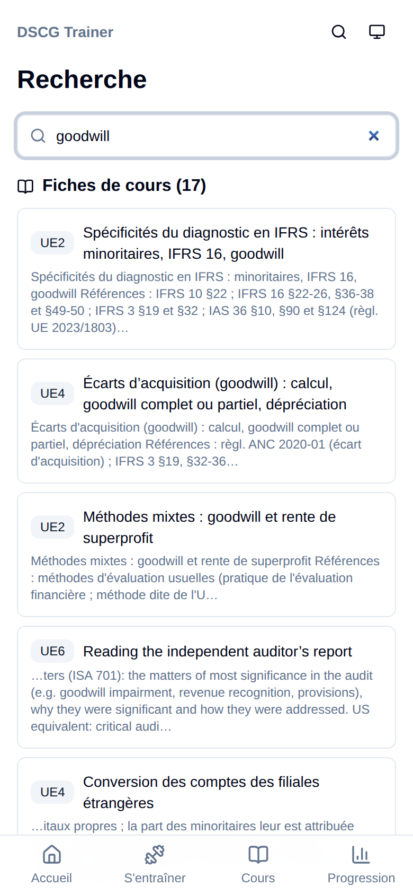

# DSCG Trainer

Application web installable (PWA) pour s'entraîner au DSCG : audit, comptabilité, IFRS, consolidation, finance, droit, fiscalité, contrôle de gestion, systèmes d'information et anglais des affaires. Elle fonctionne hors ligne sur téléphone et ordinateur ; la progression reste dans le navigateur.

**Site :** https://maxprot18.github.io/dscg-trainer/ · version 1.0.0 ([journal des versions](CHANGELOG.md))

<p>
  
  
  
  
</p>

## Contenu

- **1 400 exercices**, tous relus de façon indépendante : UE 1 (200), UE 2 (250), UE 3 (100), UE 4 (700), UE 5 (80), UE 6 (70, en anglais).
- **8 types** : QCM, vrai / faux, calcul, écriture comptable corrigée compte par compte, cas pratique, cas de consolidation guidé, cas d'audit, flashcard.
- **271 fiches de cours**, une par notion du programme officiel (arrêté du 4 août 2025), avec les références (articles, paragraphes de normes, comptes PCG) et les formules clés.

## Fonctionnalités

- **S'entraîner** : session rapide (10 questions, 5 minutes), session par UE, thème ou notion, **révision intelligente** par répétition espacée (SM-2), **mode erreurs**, **examen blanc** chronométré à la durée de l'épreuve, noté sur 20 et corrigé à la fin.
- **Progression** : taux de réussite par UE, thème et notion (à revoir, en cours, maîtrisé), carte de chaleur du programme, série de jours, temps passé, historique des sessions, export et import JSON.
- **Cours** : une fiche par notion, avec un lien direct vers ses exercices.
- **Qualité de vie** : mode sombre, recherche plein texte (raccourci « / »), raccourcis clavier (1-9 pour répondre, Entrée pour valider), bouton « signaler une erreur » qui ouvre une issue GitHub pré-remplie.

<p>
  
  
  
</p>

## Installer sur le téléphone

Ouvrir le site, puis « Ajouter à l'écran d'accueil » (Safari sur iPhone, menu ⋮ de Chrome sur Android). L'application se met à jour toute seule et reste utilisable hors ligne.

La progression est stockée dans le navigateur de l'appareil : pour la sauvegarder ou changer d'appareil, utilisez **Progression → Sauvegarde → Exporter**, puis **Importer** sur l'autre appareil.

## Développement

```bash
npm ci
npm run dev        # http://localhost:5173
npm run validate   # vérifie tout le contenu de /content
npm test
npm run build
```

Le contenu (exercices, fiches de cours, taxonomie du programme) vit dans [`content/`](content/), au format JSON validé par les schémas Zod de [`src/content/schema.ts`](src/content/schema.ts). Chaque push sur `main` est testé puis déployé sur GitHub Pages par GitHub Actions. Pour contribuer, voir [`CONTRIBUTING.md`](CONTRIBUTING.md).

## Licences

- Code : [MIT](LICENSE)
- Contenu (`content/`) : [CC BY-SA 4.0](content/LICENSE)

Les exercices sont rédigés en propre à partir des textes officiels publics (programme du DSCG, PCG, codes, NEP, IFRS adoptées par l'UE) ; aucun contenu n'est repris de sites tiers.
